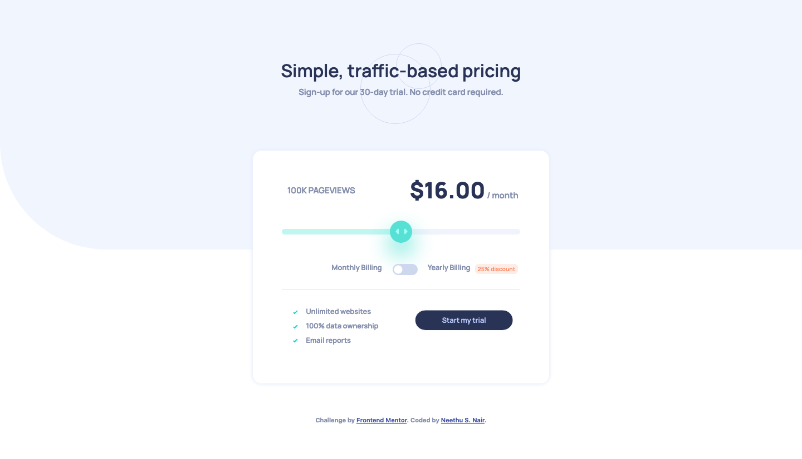
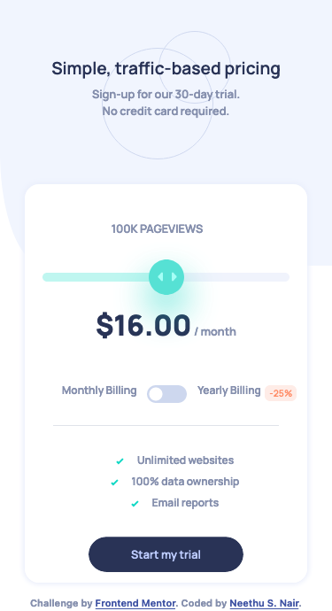

# Frontend Mentor - Interactive pricing component solution

This is a solution to the [Interactive pricing component challenge on Frontend Mentor](https://www.frontendmentor.io/challenges/interactive-pricing-component-t0m8PIyY8). Frontend Mentor challenges help you improve your coding skills by building realistic projects.

## Table of contents

- [Overview](#overview)
  - [The challenge](#the-challenge)
  - [Screenshot](#screenshot)
  - [Links](#links)
- [My process](#my-process)
  - [Built with](#built-with)
- [Author](#author)

## Overview

### The challenge

Users should be able to:

- View the optimal layout for the app depending on their device's screen size
- See hover states for all interactive elements on the page
- Use the slider and toggle to see prices for different page view numbers

#### Page view and pricing totals

Here are the different page view ranges and the corresponding monthly price totals:

- 10K pageviews / $8 per month
- 50K pageviews / $12 per month
- 100K pageviews / $16 per month
- 500k pageviews / $24 per month
- 1M pageviews / $36 per month

If the visitor switches the toggle to yearly billing, a 25% discount should be applied to all prices.

### Screenshot

#### Desktop Design

#### Mobile design

### Links

- Solution URL: [@nees101/FrontendMentor](https://www.frontendmentor.io/solutions/interactive-pricing-component-using-css-bootstrap-and-jquery-5W7YszrAO)
- Live Site URL: [@nees101/Github]( https://nees101.github.io/Interactive-Pricing-Component/)

## My process

### Built with

- Semantic HTML5 markup
- CSS custom properties
- Bootstrap
- jQuery

## Author

- Frontend Mentor - [@nees101](https://www.frontendmentor.io/profile/nees101)
- Github - [@nees101](https://www.GitHub.com/nees101)
